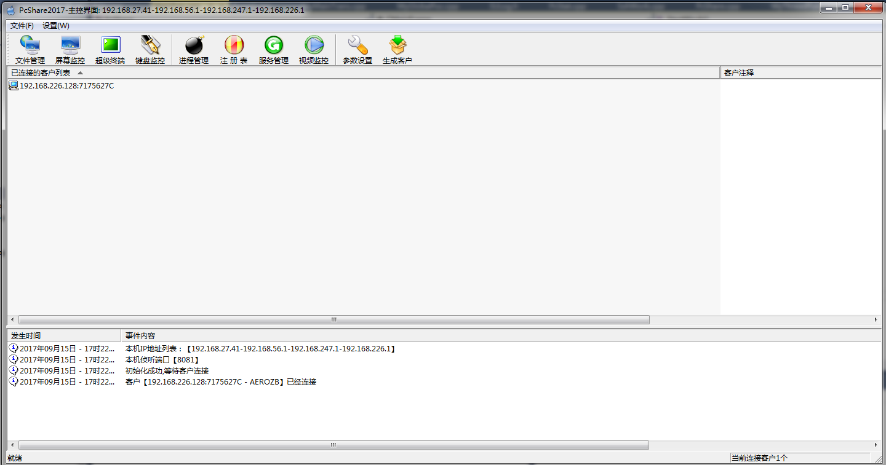
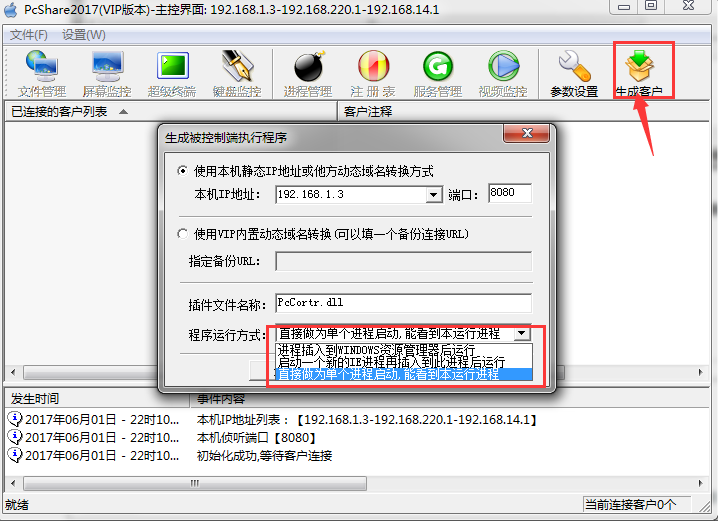
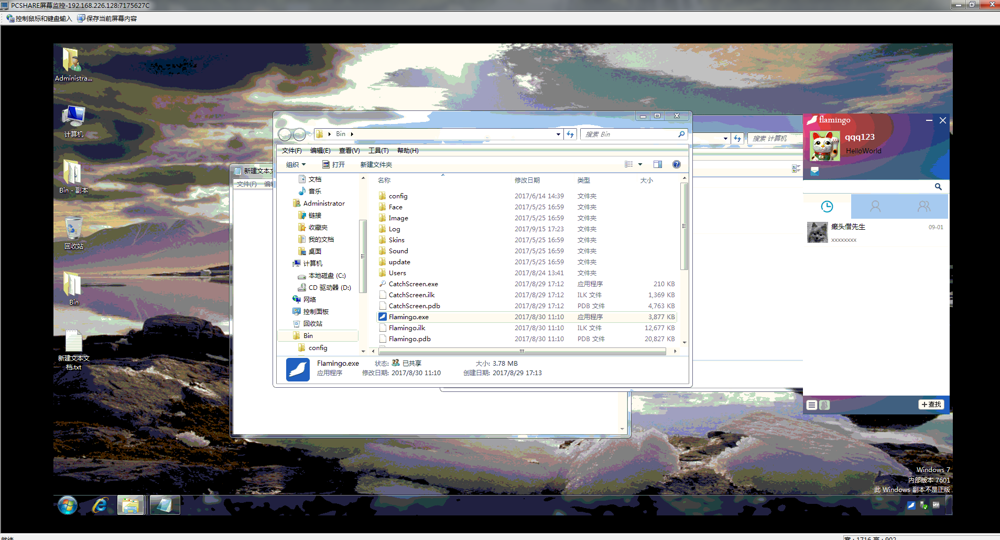
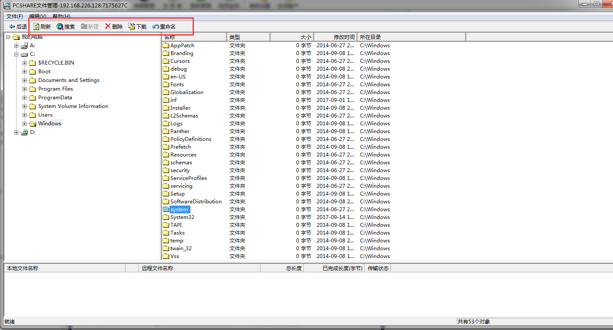
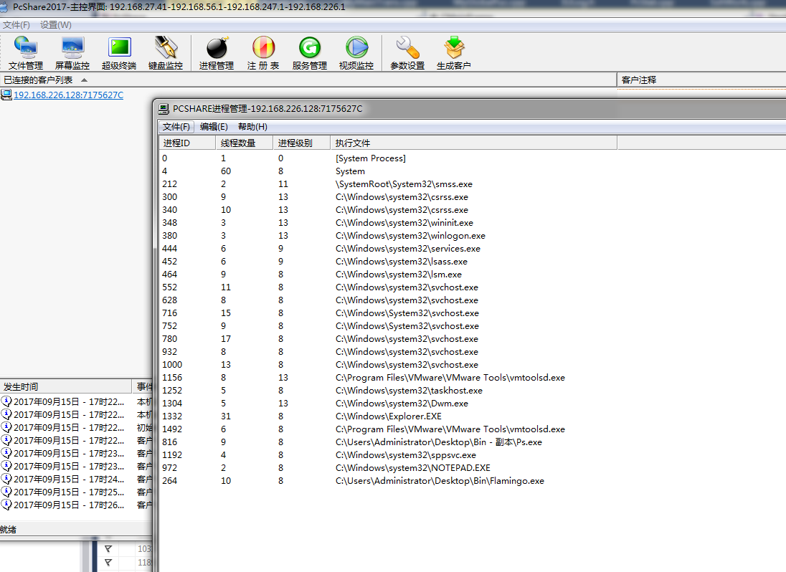
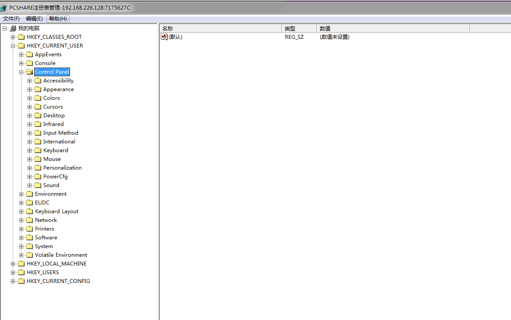
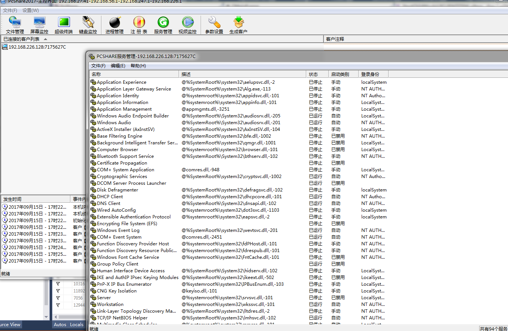
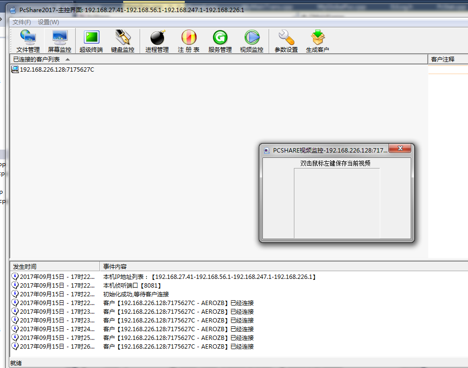

# 开放一款远程控制软件 —— pcshare

这里开放一款远程控制软件的源码——pcshare，该软件分为被控制端和控制端。部分界面如下：

控制端通过寄生在被控制端的后台程序来实现控制，可以对被控制台进行文件管理、屏幕监控、键盘监控、监控管理、查看被控制端的服务和注册表，甚至是控制被控制端的摄像头。

### 一、软件使用方法介绍：

1. 启动PcShare.exe，这是控制端主程序，该程序会在8080端口上监听被控制端的连接。
2. 生成被控制端宿主程序，点击控制端主界面上的“生成客户按钮”：

3. 生成一个新的宿主程序，这个程序的名称叫ps.exe，然后将ps.exe与PcStat.exe一起发给要被控制的机器上。在被控制的机器上启动PcStat.exe，过一会儿被控制端就连接上控制终端了，控制终端就可以对被控制终端进行各种控制了。

**监控和操作别人电脑：**

**查看和操作被控制的电脑磁盘文件：**

**查看和操作被控制电脑的进程：**

**查看被控制电脑的的注册表：**

**查看被控制电脑服务程序：**

**如果别人电脑有摄像头，还可以打开监控摄像头：**

### 二、原理介绍

控制端生成的宿主程序ps.exe实际上是一个后台程序，该程序先由PcStat.exe启动，ps.exe被启动后，释放自己二进制文件尾部的节，该节实际上是一个dll文件，这个dll可以根据生成时的配置信息以三种方式运行：

1、独立进程运行

2、注入到ie浏览器中运行

3、注入到windows资源管理中运行（explorer.exe）。

dll运行以后会hook操作系统的各种消息，以实现对该机器的监控；并通过socket连接控制终端PcShare.exe，将获得的各种信息以http协议发给PcShare.exe。PcShare.exe对目标机器的控制也是通过http协议发回给dll程序。

### 三、涉及的技术

1. mfc框架
2. windows hook技术
3. http协议
4. socket
5. windows消息机制
6. PE文件相关知识

### 四、程序编译：

程序使用mfc框架开发， 用VS2015打开PcShare目录下PcShare.sln，运行编译即可。如果需要调试控制端或者被控制端，你可以先在外部启动一个，再在VS里面调试另外一个。

### 五、最新代码下载链接（更新至2025年5月）：

在公众号【CppGuide】中回复关键字【pcshare】即可得到下载链接。

> 注意：请勿使用该软件作任何非法用途，否则后果自负。
